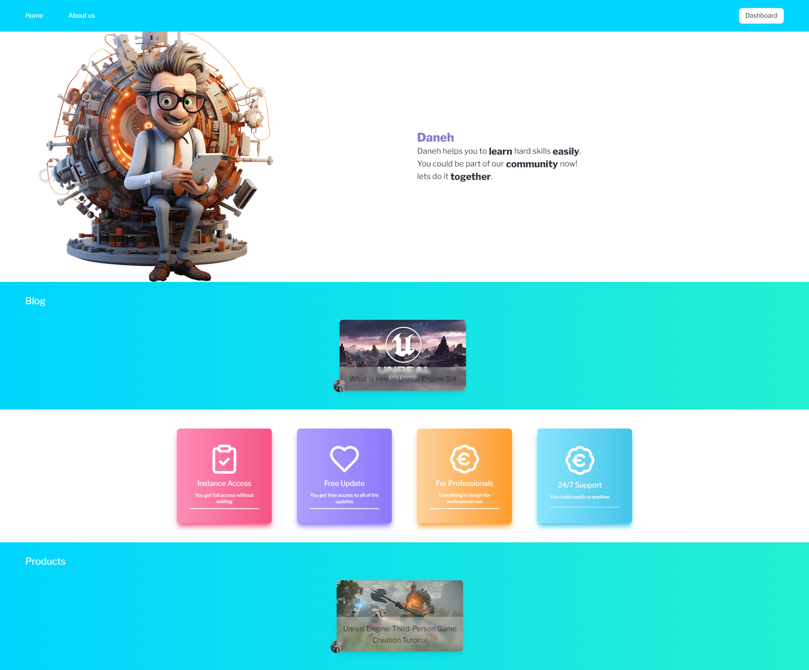
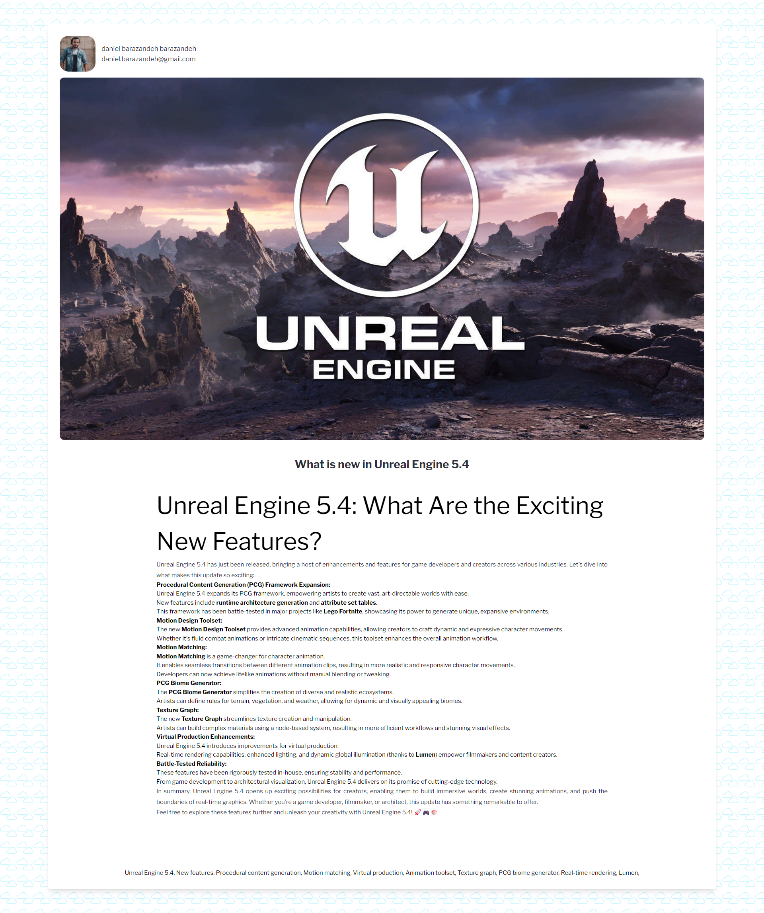
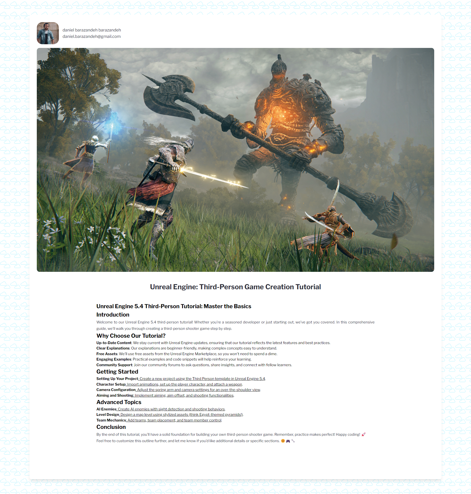
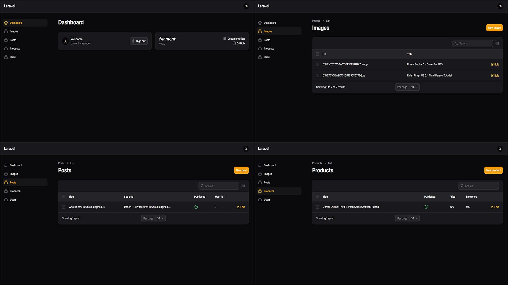

## About Daneh

Daneh is a full-stack Laravel project that aims to provide a suitable online platform for selling tutorials. You could upload your content into Daneh and choose a price for them so pepole who subscribed to them could have access to them. you could post blogs in it, manage your users and easily update your products with few clicks. you also get an admin dashboard and a user dashboard for your project.

## Features

- Google authentication
- Filament dashboard
- Migration for database
- Clean blade code
- Tailwind styling

# Blog
You could use the blog system to upload posts about anything you want to improve the SEO on your website. 

# Product
You could sell tutorials on any subject you like, share the content as video, text, file or any other form you see fit.

# Admin Dashboard
In the admin dashboard you could manage your posts, users, products and media that you have uploaded. 

